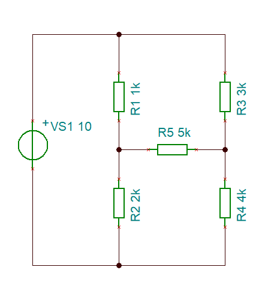
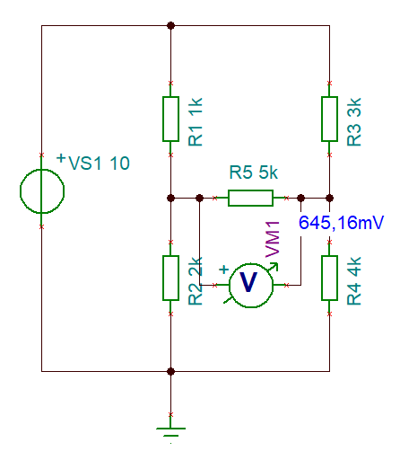
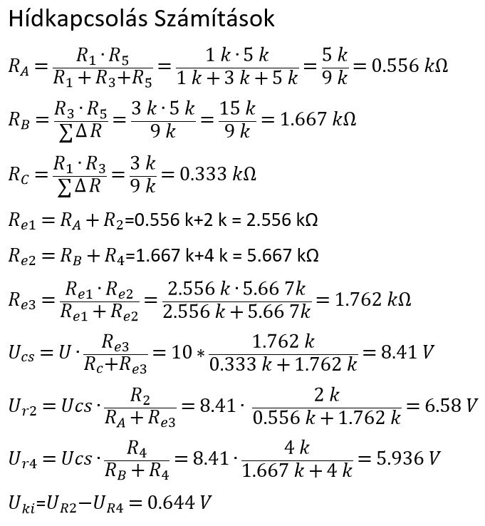

### 2. Projekt. Orosz Szabolcs
[VISSZA](https://oroszszr.github.io/portfolio/)

### Projekt neve : Hídkapcsolás
Projekt ismertetése : Kiegyenlítetlen hídkapcsolás kimeneti feszültségének meghatározása
a; szimulácis méréssel 
b; valós méréssel
c; számítással (delta-csillag méréssel)

#### Kapcsolási rajz

|Név|Jelölés|Érték|darab|
|----|----|----|------|
|Ellenállás|R1|1k|1|
|Ellenállás|R2|2k|1|
|Ellenállás|R3|3k|1|
|Ellenállás|R4|4k|1|
|Ellenállás|R5|5k|1|
|Feszültségforrás|VM1|10V|1|

#### Szimulációs mérés eredménye

### Számítások eredménye

### Önreflexió
A projekt nem volt bonyolult, megérthető volt és nem volt bonyolult. A projekt elkészítése segített a tananyag megértését, képletek használatát. Nehézség nem nagyon volt benne, a TINA nevű alkalmazás volt ismeretlen számomra az elején, de abba is bele jöttem úgyahogy.
Várom a további projekteket, feladatokat.